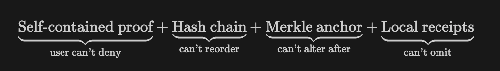
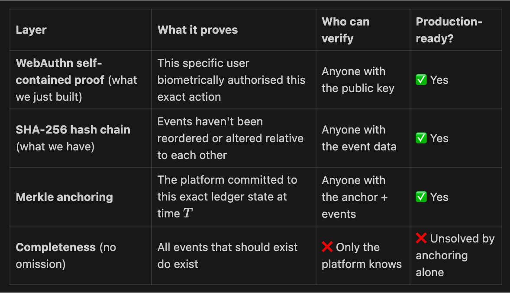

# Pitch Deck — SME Procurement-to-Pay Platform

> 5 slides for the UK Innovation Challenge
> Theme: Accelerating payment and improving liquidity for SMEs

---

## Slide 1 — The Problem

### £22,000. Every year. For doing nothing wrong.

Late payments cost the average UK SME **£22,000 per year** — not because they failed to deliver, but because the systems meant to pay them are slow, manual, and built on blind trust.

**50,000 SMEs close annually** as a direct result.

The root cause isn't greed or malice. It's **architecture**.

| What happens today | Why it's broken |
|---|---|
| Supplier delivers goods | No shared proof of completion |
| Buyer "processes" invoice | Manual verification, email chains, spreadsheets |
| Payment sits in a queue | No automated trigger, no condition logic |
| Supplier waits 30–90 days | Cashflow dries up, growth stalls |
| Supplier seeks finance | Lender re-verifies everything from scratch at 5–15% cost |

**The insight:** Payments are slow because verification is manual and trust is external. Every participant — buyer, supplier, financier — rebuilds confidence independently, from scratch, every time.

**This is not a payments problem. It is a verification problem.**

---

## Slide 2 — Our Approach

### Digitally verifiable payment conditions that make money move itself

We replace the slow cycle of invoice → verify → dispute → pay with a **single orchestrated flow** where payment conditions are explicit, machine-readable, and cryptographically signed from the start.

**Four primitives power everything:**

**1. Conditional Payment Locking**
The buyer pre-authorises payment when issuing a purchase order. Funds are ring-fenced — not transferred, not a deposit — a binding digital commitment that the supplier can see and trust before starting work.

**2. Event-Driven Release**
Payment releases automatically when conditions are met: buyer confirmation, delivery verification, milestone completion, or a configurable acceptance window (auto-release after 48 hours of buyer silence). No invoices. No chasing. No disputes.

**3. Pre-Verified Receivables**
Because the payment is already authorised and the conditions are digitally explicit, the supplier's receivable is **pre-verified from the moment they accept the PO**. This is not a traditional invoice — it is a guaranteed, condition-locked payment right.

**4. Embedded Liquidity**
A supplier who cannot wait for delivery can tap early payment instantly — funded by regulated liquidity partners through the platform. Because uncertainty has been removed, financing costs drop from the industry standard of 5–15% to as low as 1–3%. This is not a loan. The supplier takes on no debt. The liquidity partner purchases a pre-verified payment right.

> **"Where suppliers require earlier access to cash, the platform enables early settlement of pre-authorised payments through regulated liquidity partners. These partners advance funds against digitally verified payment commitments, enabling same-day liquidity without increasing SME debt."**

**The result:** Liquidity is attached to the transaction, not to the balance sheet. A supplier's ability to get paid fast depends on the quality of the deal — not the size of their company.

---

## Slide 3 — Security Architecture

### Every approval is signed. Every event is chained. Every proof is independently verifiable.

Trust in this platform is not a policy — it is a **mathematical property**. We built three interlocking cryptographic layers that produce evidence no party — including us — can forge, alter, or deny.

**Layer 1: Hardware-Bound Digital Signatures (WebAuthn / FIDO2)**

Every critical action — approving a purchase order, confirming delivery, authorising early payment — is signed using **passkeys**: cryptographic credentials bound to the user's device hardware (biometric sensor, security key, or platform authenticator). Private keys never leave the device. They cannot be phished, intercepted, or extracted.

This is the same standard used by Google, Apple, and Microsoft for passwordless authentication — repurposed here to sign **business intent**.

**Layer 2: Tamper-Evident Hash Chain (SHA-256)**

Every signed event is appended to an **immutable, hash-chained ledger**. Each entry includes a SHA-256 hash of the previous entry, creating a sequential chain where any insertion, deletion, or modification of a past record **breaks every subsequent hash** and is immediately detectable.

This is the same principle that underpins blockchain — without the overhead of consensus, gas fees, or token economics. A hash chain gives tamper evidence. That is all we need.

**Layer 3: Self-Contained Cryptographic Proofs**

Here is where we go beyond standard practice. When a user signs an action, the platform computes an **intent hash** — a SHA-256 digest of the business intent (event type, entity ID, actor ID) — and uses it as the WebAuthn authentication challenge. This means:

- The user's device signs **the specific business action**, not a random nonce
- The resulting signature is cryptographically bound to both the **user's identity** and the **exact action they approved**
- Anyone with the proof bundle can independently verify: *"This person approved this specific action at this time, and the signature is mathematically valid"*

**What this means in practice:**

| Scenario | Traditional platform | Our platform |
|---|---|---|
| "Did the buyer approve this PO?" | Check our database (trust us) | Verify the signature yourself (trust maths) |
| "Was this record tampered with?" | We say it wasn't (trust us) | Recompute the hash chain (trust maths) |
| "Did the supplier consent to early payment?" | We have a log entry (trust us) | The intent hash is embedded in their signature (trust maths) |

Every proof bundle is a **self-contained evidence packet** that can be verified by any party, at any time, without contacting our platform.

---

## Slide 4 — Attack Resistance

### What could go wrong — and why it can't

We designed against four categories of attack. For each, we show the threat, the defence, and the residual risk.

**Attack 1: Fabrication** — *"Someone creates a fake approval"*

| | |
|---|---|
| **Threat** | A malicious actor (or the platform itself) fabricates a signed event — e.g., a fake delivery confirmation |
| **Defence** | Every approval requires a WebAuthn signature from the user's hardware-bound passkey. The private key never leaves the device. The platform cannot sign on behalf of any user, even with full database access |
| **Residual risk** | Device compromise (mitigated by biometric unlock) |

**Attack 2: Tampering** — *"Someone alters a past record"*

| | |
|---|---|
| **Threat** | A database administrator or attacker modifies a historical ledger entry — e.g., changing a payment amount |
| **Defence** | Every entry includes a SHA-256 hash of the previous entry. Any modification breaks the chain from that point forward. Chain integrity is verified on read |
| **Residual risk** | Full database replacement (mitigated by local receipts and future Merkle anchoring — see Slide 5) |

**Attack 3: Repudiation** — *"A signer denies they approved something"*

| | |
|---|---|
| **Threat** | A buyer approves a PO, the supplier starts work, and the buyer later claims they never approved it |
| **Defence** | The self-contained proof binds the user's passkey signature to the specific business intent via the intent hash challenge. The `clientDataJSON` (part of the WebAuthn protocol) contains the challenge, origin, and signature context. This is not a platform log — it is a cryptographic receipt |
| **Residual risk** | None, assuming key-to-identity binding is established (see Slide 5) |

**Attack 4: Omission** — *"The platform silently deletes a record"*

| | |
|---|---|
| **Threat** | The platform removes an inconvenient event from the ledger — e.g., deleting evidence of a disputed delivery |
| **Defence** | The hash chain creates a sequential dependency: removing any entry breaks all subsequent hashes. Gaps are detectable by any party who holds even one receipt |
| **Residual risk** | Truncation of the chain tail (mitigated by periodic Merkle root anchoring to external transparency logs — see Slide 5) |

**Key takeaway:** We do not ask participants to trust the platform. We give them **evidence they can verify independently**. The platform is an orchestrator, not an authority.

---

## Slide 5 — Scalability, Trust Anchors & Production Path

### Built on battle-tested standards with a clear path to institutional grade

**What we use today — and why it already works**

| Component | Standard | Production precedent |
|---|---|---|
| Digital signatures | WebAuthn / FIDO2 | Used by every major tech company for 4+ billion accounts |
| Tamper evidence | SHA-256 hash chain | Same primitive as Certificate Transparency (Google, Let's Encrypt) |
| Intent binding | WebAuthn challenge override | Novel application of an existing protocol mechanism |
| Key management | Device-native (Secure Enclave, TPM) | No custom cryptography — OS-level protection |

**We invented nothing.** We composed existing, audited, battle-tested standards into a trust architecture purpose-built for procurement-to-pay.

**The production roadmap — three additions that elevate to institutional grade:**

**1. Merkle Root Anchoring**
Periodically compute a Merkle tree over all ledger entries and publish the root hash to an external transparency log (RFC 6962). Any party can request an inclusion proof to verify their transaction exists in the canonical ledger — even if the platform goes offline. This is the same mechanism that secures every HTTPS certificate on the internet.

**2. RFC 3161 Timestamping**
Submit event hashes to an independent Timestamping Authority operated by a Certificate Authority under audit (e.g., DigiCert, Sectigo). This provides legally recognised proof of when each event occurred, independent of our platform clock.

**3. Key-to-Identity Binding**
The final trust anchor: proving that a public key belongs to a specific, verified person. Three paths exist — platform-attested identity (KYC), certificate-based identity (X.509 from a CA), or decentralised identity (DIDs + verifiable credentials). Each adds a layer of assurance appropriate to the regulatory context.

**Why this can be trusted**

> The platform cannot forge signatures — private keys live on user devices.
> The platform cannot alter history — the hash chain is independently verifiable.
> The platform cannot deny what happened — every proof is self-contained.
> The platform cannot hide events — Merkle anchoring makes omission detectable.

**What we are building is not a fintech app with a database.**
**It is a cryptographic payment orchestration layer where trust is a mathematical property, not a commercial promise.**

---

## Speaking Notes — Framing for Judges

**If asked "Why not just use blockchain?"**
> "We use the same cryptographic primitives — hash chains, digital signatures, Merkle trees — but without the overhead of consensus mechanisms, gas fees, or token economics. We need tamper evidence and non-repudiation, not decentralised compute. Our approach is lighter, faster, and deployable on commodity infrastructure today."

**If asked "How is this different from invoice factoring?"**
> "Invoice factoring happens after delivery, depends on buyer creditworthiness, requires manual verification, and costs 5–15%. Our platform creates pre-verified receivables at the point of purchase order acceptance — before work starts. The uncertainty that drives traditional financing costs is removed by architecture, not by underwriting."

**If asked "Who provides the liquidity?"**
> "Regulated liquidity partners via API — banks, fintech lenders, or balance-sheet providers already authorised to advance funds against predictable cashflows. We are not a lender. We orchestrate verified payment flows and connect them to licensed capital."

**If asked "What about regulation?"**
> "We do not take deposits, lend money, assess credit, or hold customer funds. We are a payment orchestration and verification layer. Our liquidity partners hold the relevant regulatory permissions. This keeps FCA scope minimal and realistic for a £50k challenge."

**If asked "Can you prove this works?"**
> "Yes. Our MVP includes a working proof endpoint. For any signed event, we can produce a self-contained evidence bundle containing the original business intent, the cryptographic signature, the hash chain context, and step-by-step verification instructions. Any developer with access to standard WebAuthn libraries can independently verify it."

---
Merkle anchoring is production-ready, robust, secure, and scalable. RFC 3161 is used in legal proceedings. CT logs protect billions of connections. These are not experimental.
But no single mechanism delivers full decentralised trust. What delivers trust is the composition:

Each layer eliminates a specific class of attack. Together they give you a system where:
Users can't deny their actions (passkey)
The platform can't rewrite history (hash chain + anchor)
Omissions are detectable by any affected party (receipts)

The only entity you're still trusting is the timestamping authority — but RFC 3161 TSAs are typically operated by Certificate Authorities under strict audit (e.g., DigiCert, GlobalSign), and their trustworthiness is the same foundation HTTPS relies on. If you trust HTTPS, you can trust this.
What this architecture doesn't do is eliminate the platform entirely — but for a regulated fintech, that's actually appropriate. The FCA expects an accountable operator. The goal isn't to remove the platform; it's to make the platform cryptographically unable to cheat without detection.

